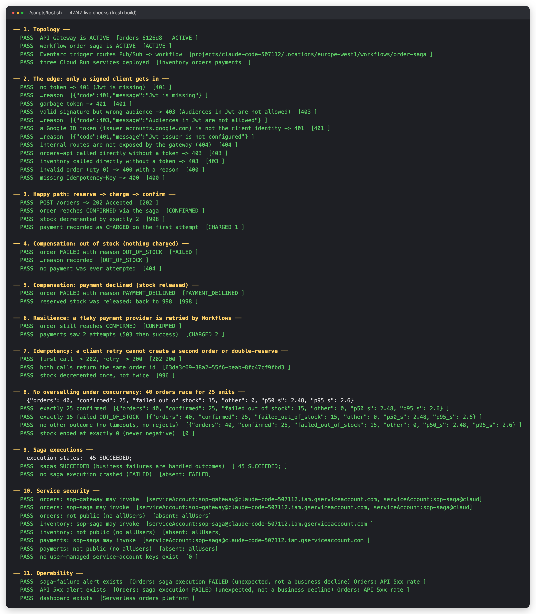
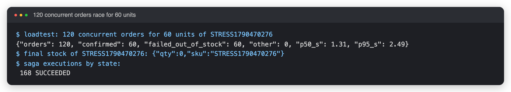
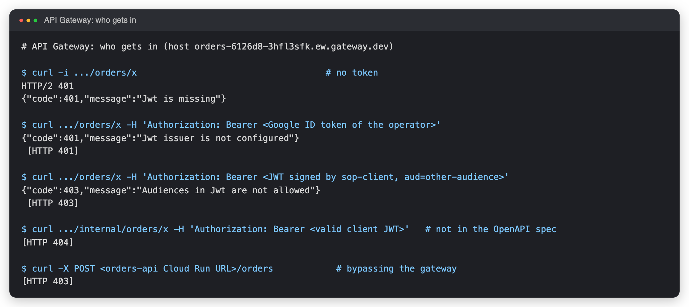
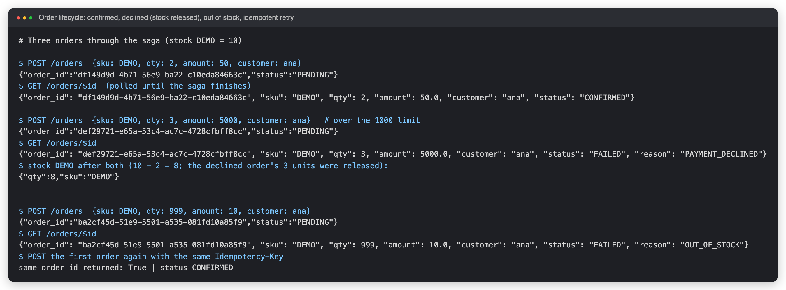
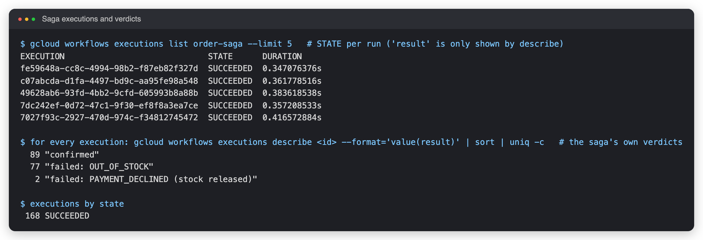
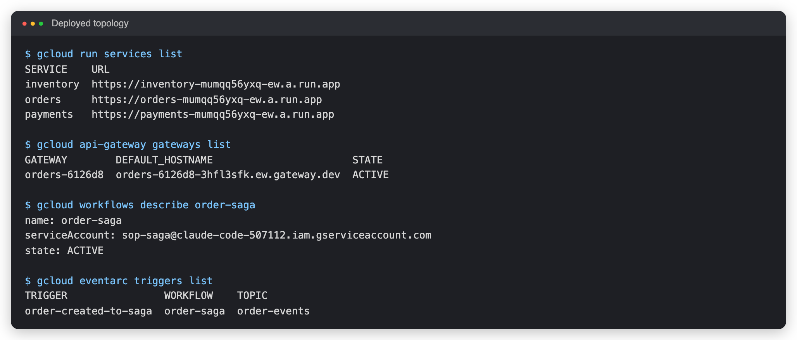
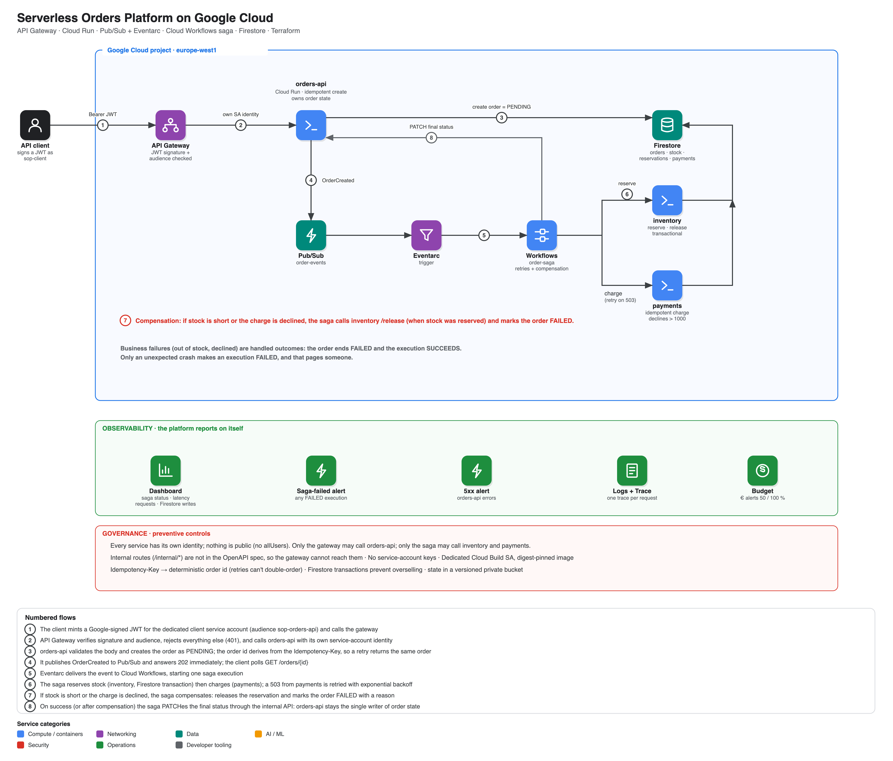

# Serverless Orders Platform on Google Cloud

An event-driven **order-processing platform with no servers to run**: a JWT-protected **API Gateway** in front of **Cloud Run**, orders accepted with `202` and processed by a **Cloud Workflows saga** (reserve stock → charge → confirm) that **retries** transient failures and **compensates** business failures, on **Firestore**. Provisioned and destroyed by **one script each**, with every claim asserted against the running system — including a concurrency test that races 120 orders for 60 units.

> **Status: deployed and verified live** (europe-west1, 2026-09-27). `./scripts/up.sh` builds it in two Terraform phases and [`scripts/test.sh`](scripts/test.sh) passes **47 of 47** ([results](docs/test-results.md)). The fresh build also *found a real bug* (saga crashes under contention) that is fixed and documented in [runbook 05](docs/runbooks/05-incident-response.md). The stack was then removed with `./scripts/down.sh`.

```bash
gcloud config set project <your-project>      # billing linked; the rest is auto-detected
./scripts/up.sh       # infra → image build → 3 services + saga + trigger + gateway → seed → live tests   (~20 min, mostly API Gateway)
./scripts/down.sh     # delete everything (--purge also drops the state)
```

## Evidence (captured from the live deployment)

| | |
|---|---|
|  |  |
| **`scripts/test.sh`** — 47 checks: edge auth, happy path, both compensations, retry, idempotency, overselling, security | **120 orders race for 60 units** → exactly 60 confirmed, 60 out-of-stock, stock 0, every saga `SUCCEEDED` |

| | |
|---|---|
|  |  |
| **The edge** — no token 401, wrong issuer 401, wrong audience 403, internal path 404, bypass 403 | **Order lifecycle** — confirmed; declined → stock released; out of stock; idempotent retry |

| | |
|---|---|
|  |  |
| **Saga executions** — the saga's verdicts across 168 runs (89 confirmed, 77 out of stock, 2 declined); none crashed | **Topology** — three services, gateway, workflow, Eventarc trigger |

The Cloud Console views are not included: the console needs an interactive Google sign-in that automation cannot perform. Evidence text lives in [`docs/evidence/`](docs/evidence) and is regenerated by [`scripts/capture-evidence.sh`](scripts/capture-evidence.sh).

## What it proves

| Concern | Mechanism | Proven by |
|---|---|---|
| **Only a known client gets in** | Gateway verifies a JWT *signed by* `sop-client` (issuer, keys, audience) | test §2: 401/403 with reasons; valid → 202 |
| **No back doors** | Nothing public; `/internal/*` not in the API spec; per-service invokers | test §2, §10 |
| **Async, safe API** | `202` + poll; mandatory `Idempotency-Key` → same order, no second event | test §3, §7 |
| **Business failures don't crash** | Out of stock / declined → compensate, order `FAILED` with reason, execution `SUCCEEDED` | test §4, §5 |
| **Transient failures are absorbed** | Flaky payments (503) retried with backoff → still `CONFIRMED`, 2 attempts | test §6 |
| **No overselling** | Firestore transactions + per-order reservations | test §8: 40 vs 25 → 25/15/0; stress: 120 vs 60 → 60/60/0 |
| **Pages only on real failure** | Alert on `FAILED` executions (crashes), not on declines | test §9 |
| **Least privilege** | One SA per job, no SA keys | test §10 |

## Architecture

[](docs/img/architecture.svg)

<sub>Click for the vector version. Diagram source: [`docs/diagrams/architecture.py`](docs/diagrams/architecture.py).</sub>

More: [architecture](docs/architecture.md) · [threat model](docs/threat-model.md)

## Design decisions

| ADR | Decision |
|---|---|
| [0001](docs/adr/0001-workflows-saga-over-choreography.md) | Cloud Workflows orchestrates the saga; business failures are handled outcomes |
| [0002](docs/adr/0002-signed-jwt-at-the-gateway.md) | Gateway trusts JWTs signed by one SA, not any Google ID token |
| [0003](docs/adr/0003-idempotency-and-transactions.md) | Idempotent create, transactional stock, idempotent payments |

## Runbooks

[docs/runbooks](docs/runbooks/README.md): build & teardown · call the API · trace an order · stock & payments · incident response · change the saga · cost · troubleshooting (12 real problems hit while building this).

## Repository layout

```
terraform/   run · workflow (Eventarc + Workflows) · gateway · data (Firestore, Pub/Sub) · identities · monitoring
workflows/   order-saga.yaml — the whole business flow, retries and compensation
api/         openapi.yaml.tftpl — the public contract the gateway enforces
app/         orders / inventory / payments (Flask on Cloud Run) + unit tests
scripts/     up.sh · down.sh · test.sh · stress.sh · loadtest.py · capture-evidence.sh
```

## Cost & safety

Well under €1 for a full build–test–teardown; Cloud Run scales to zero; a budget with alerts is created by Terraform; `down.sh` deletes the Firestore database with its data.

## Known gaps (deliberate)

No end-user authentication (Identity Platform) · no per-client quotas (needs API keys) · no WAF (needs a load balancer) · saga state lives in Workflows + Firestore, not an outbox (a crash between "create order" and "publish" would leave a `PENDING` order; see runbook 05 for re-driving) · single region · payments/inventory are simulated.

## License

MIT
